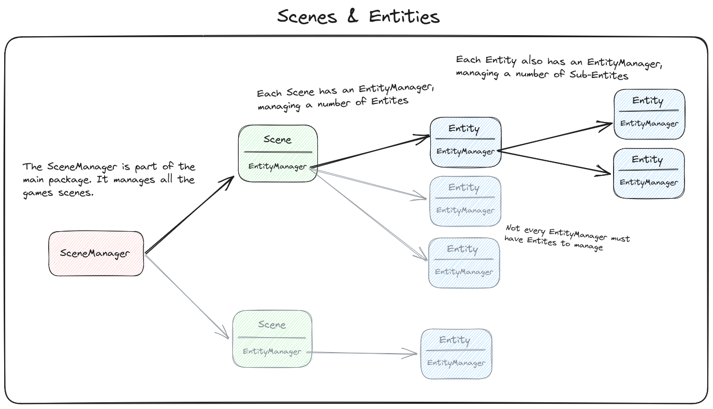

<!-- LTeX: language=en-US -->
# Scenes & Entities

`Scenes` and `Entities` are the basic building blocks of a game. While `Scenes`
act as large, overarching constructs, that can optionally be layered over one
another, `Entities` can be more atomic, and often fulfill only one specific
purpose.

## Scene
Each `Scene` is a collection of entities, and its primary purpose is to manage
these entities as a group, essentially building presentable "scenes". An
example of a Scene might be a `MainMenu`. A `MainMenu` would be comprised of a
number of `Button` Entities, and maybe a `Background` and a `MusicPlayer`
Entity.

## Entity
Each `Entity` usually fulfills one specific task or represents a specific
object in the game. An example of a (more complex) Entity might be a `Player`.
This Entity would save fields such as a `position`, a `sprite`, `health`, etc.
and would be responsible for things like drawing the sprite and gaining/losing
health.

Specific systems like the `health` may also be abstracted into their own entity,
as each entity (such as a `Player`) may have sub-entities (such as `Health`).
That way, the `Health` entity could be reused for an `Enemy` entity.

## Interplay / Structure
Here is a visualization of how Scenes and Entities are structured to work
together:

